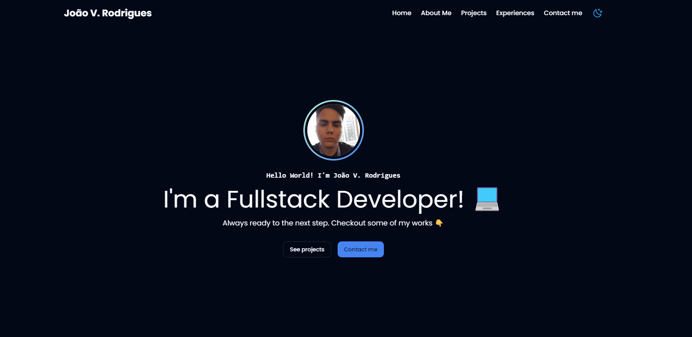

 <h1>My Portfolio</h1>

 

  

## 🚀 Tecnologias

Esse projeto foi desenvolvido com as seguintes tecnologias:

- [React](https://reactjs.org)
- [Vite](https://vitejs.dev/)
- [Tailwind](https://tailwindcss.com/)

## 💻 Projeto

My Portfolio é um simples projeto para eu me apresentar e mostrar meus projetos ao longo da carreira de desenvolvedor.

- [Acesse!](https://joaov-costa-my-portfolio.vercel.app/)
